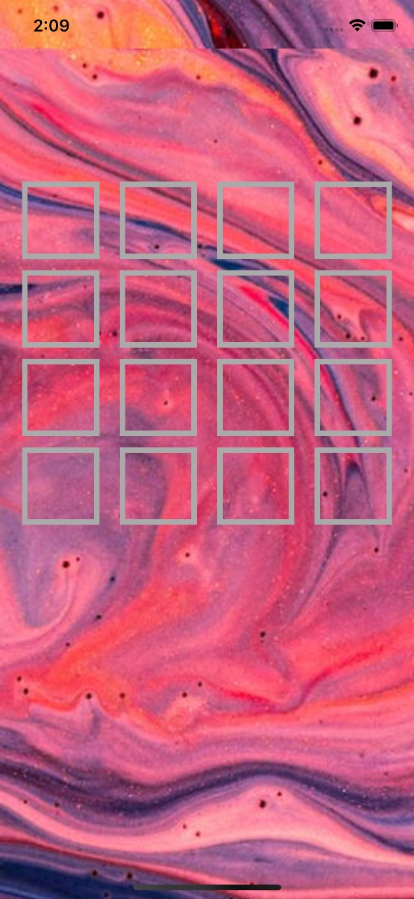
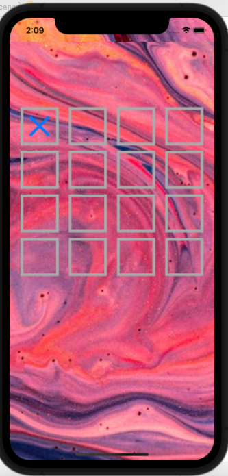
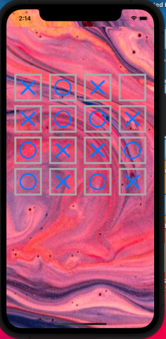
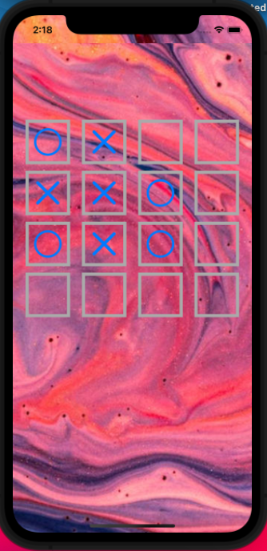
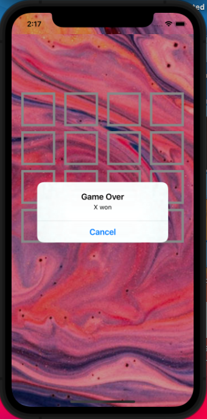

Normally Tic toc toe play with 3X3 boxes but in this iOS app user can play 4X4 tic tac toe with greate UI

As you can see first whenever user will open the file at that time "TicTacToeVC" viewController will load which is mainy responsible for handling UI and logic part for the whole game.
There are total 16 boxes with 4X4 formate in the UI.

If user select any box at that time tis box will turn with "X" sign and after second selection it will turn into "0" sign.
 

As per turn user can play with its own logic where boxes select into "X" and "0" formate simultaniously.

If user draw the game at that time alert box will appear and data will set again prev. position

But if any user will won at that time the winning user will be announce at the alert box and again game will be set at starting stage.

